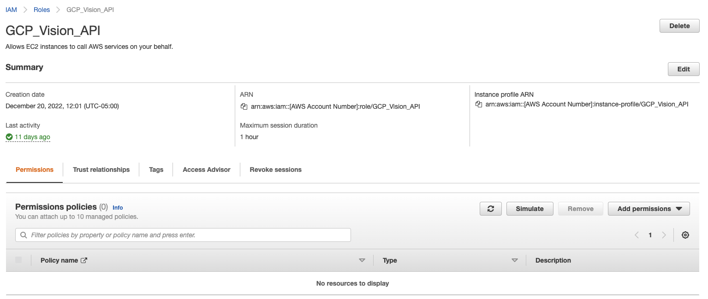
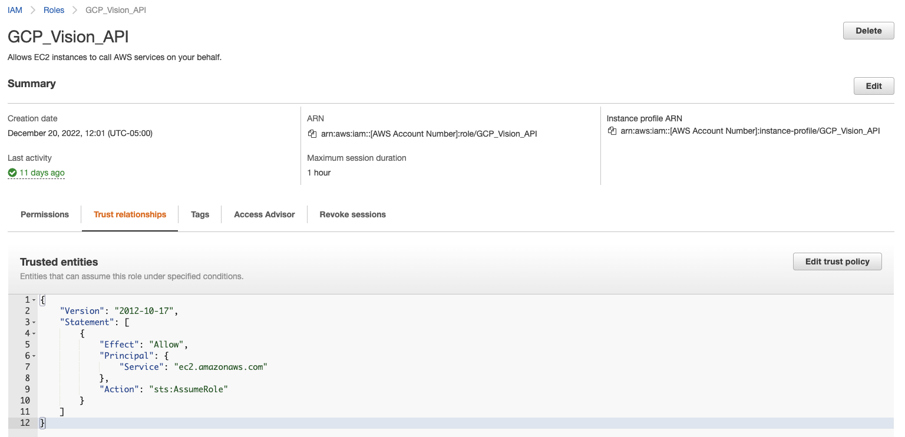
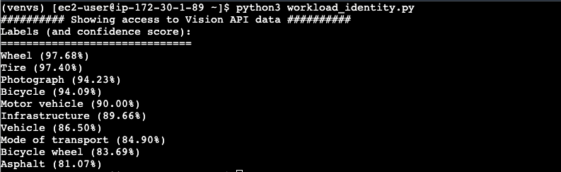

# GCP Workload Identity Federation: AWS, EC2, SDK

This is an AWS EC2 case of a multi project set of examples for configuring Google Cloud Workload Identity Federation. For further information on this set-up please refer to Google's documentation here: https://cloud.google.com/iam/docs/configuring-workload-identity-federation#aws

## Google Disclaimer
This is not an officially supported Google product

## Table of Contents
1. [Prerequisites](https://github.com/dreardon/gcp-workload-identity-federation-aws-ec2-sdk#prerequisites)
1. [Google Service Account and Identity Pool](https://github.com/dreardon/gcp-workload-identity-federation-aws-ec2-sdk#create-a-google-service-account-and-identity-pool)
1. [AWS IAM Role Creation](https://github.com/dreardon/gcp-workload-identity-federation-aws-ec2-sdk#aws-role-creation)
1. [Create Client Configuration File](https://github.com/dreardon/gcp-workload-identity-federation-aws-ec2-sdk#create-client-configuration-file)
1. [Connect Identity Pool to AWS](https://github.com/dreardon/gcp-workload-identity-federation-aws-ec2-sdk#connect-identity-pool-to-aws-create-provider)
1. [Validate Workload Identity Federation Setup](https://github.com/dreardon/gcp-workload-identity-federation-aws-ec2-sdk#validate-workload-identity-federation-pool-setup)

## Prerequisites
<ul type="square"><li>An existing Google Project, you'll need to reference PROJECT_ID later in this setup</li>
<li>Enabled services</li>

```
gcloud services enable iamcredentials.googleapis.com
gcloud services enable vision.googleapis.com
```
</ul>

## Create a Google Service Account and Identity Pool
```
export PROJECT_ID=[Google Project ID]
export PROJECT_NUMBER=[Google Project Number]
export SERVICE_ACCOUNT=[Google Service Account Name] #New Service Account for Workload Identity
export WORKLOAD_IDENTITY_POOL=[Workload Identity Pool] #New Workload Identity Pool Name

gcloud config set project $PROJECT_ID

gcloud iam service-accounts create $SERVICE_ACCOUNT \
    --display-name="AWS EC2 Workload Identity SA"

# Defines what this service account can do once assumed by AWS
gcloud projects add-iam-policy-binding $PROJECT_ID \
    --member="serviceAccount:$SERVICE_ACCOUNT@$PROJECT_ID.iam.gserviceaccount.com" \
    --role="roles/visionai.admin"

gcloud iam workload-identity-pools create $WORKLOAD_IDENTITY_POOL \
    --location="global" \
--description="Workload Identity Pool for AWS EC2" \
--display-name="AWS EC2 Workload Pool"
```

## AWS Role Creation

```
export AWS_ROLE_NAME=[AWS Role Name] #New Role for Future EC2

cat > policy-document.json << ENDOFFILE
{
  "Version": "2012-10-17",
  "Statement": [
    {
      "Effect": "Allow",
      "Principal": {
        "Service": "ec2.amazonaws.com"
      },
      "Action": "sts:AssumeRole"
    }
  ]
}
ENDOFFILE

aws iam create-role --role-name $AWS_ROLE_NAME  \
    --assume-role-policy-document file://policy-document.json  \
    --description "Role used to send images to GCP Vision API"

aws iam create-instance-profile --instance-profile-name $AWS_ROLE_NAME 
aws iam add-role-to-instance-profile --instance-profile-name $AWS_ROLE_NAME  --role-name $AWS_ROLE_NAME 

export ROLE_ARN=$(aws iam get-role --role-name $AWS_ROLE_NAME --query 'Role.[RoleName, Arn]' --output text | awk '{print $2}')
```




## Create Client Configuration File
```
gcloud iam workload-identity-pools create-cred-config \
    projects/$PROJECT_NUMBER/locations/global/workloadIdentityPools/$POOL_ID/providers/$PROVIDER_ID \
    --service-account="$SERVICE_ACCOUNT@$PROJECT_ID.iam.gserviceaccount.com" \
    --aws \
    --enable-imdsv2 \
    --output-file=client-config.json
```
Ensure this file is on the EC2 instance running the instance profile created earlier. Once there, run the following on the EC2 instance:

```
export GOOGLE_APPLICATION_CREDENTIALS=[path to client-config.json]
#e.g. export GOOGLE_APPLICATION_CREDENTIALS=/home/ec2-user/client-config.json
```

## Connect Identity Pool to AWS, Create Provider

```
export WORKLOAD_PROVIDER=[Workload Identity Provider] #New Workload Provider Name
export AWS_ACCOUNT_ID=[AWS Account ID]

#Allows AWS role attached to all EC2s to use the previously created GCP service account
gcloud iam service-accounts add-iam-policy-binding $SERVICE_ACCOUNT@$PROJECT_ID.iam.gserviceaccount.com \
    --role="roles/iam.workloadIdentityUser" \
    --member "principalSet://iam.googleapis.com/projects/$PROJECT_NUMBER/locations/global/workloadIdentityPools/$WORKLOAD_IDENTITY_POOL/attribute.aws_role/arn:aws:sts::$AWS_ACCOUNT_ID:assumed-role/$AWS_ROLE_NAME"

gcloud iam workload-identity-pools providers create-aws $WORKLOAD_PROVIDER  \
  --location="global"  \
  --workload-identity-pool=$WORKLOAD_IDENTITY_POOL \
  --account-id="$AWS_ACCOUNT_ID" \
  --attribute-mapping="google.subject=assertion.arn","attribute.aws_role=assertion.arn.contains('assumed-role') ? assertion.arn.extract('{account_arn}assumed-role/') + 'assumed-role/' + assertion.arn.extract('assumed-role/{role_name}/') : assertion.arn"
```

## Validate Workload Identity Federation Pool Setup
Add the the $AWS_ROLE_NAME to the EC2 instance as an instance profile and run the following.
```
pip3 install -r requirements.txt
python3 workload_identity.py
```
